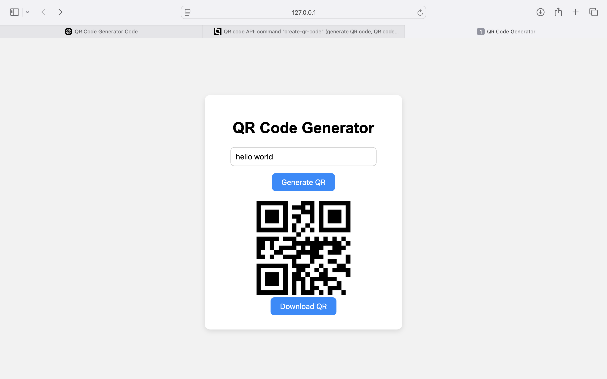

# 🔳 QR Code Generator

A simple and fast QR Code Generator built using HTML, CSS, and JavaScript with the help of the [goqr.me API](https://goqr.me/api/).

## 🚀 Features

- Enter any text, URL, or data.
- Generate QR Code instantly.
- Preview the QR image.
- Download the generated QR Code as a `.png`.

## 📷 Demo


## 🛠️ Tech Stack

- HTML
- CSS
- JavaScript
- [GoQR API](https://api.qrserver.com/v1/create-qr-code/)

## 📁 Project Structure

```
qr-code-generator/
│
├── index.html       # Main HTML page
├── style.css        # Stylesheet
├── script.js        # JavaScript logic
└── README.md        # Project documentation
```

## 💻 Usage

1. Clone or download this repository.
2. Open `index.html` in any web browser.
3. Enter text and click **"Generate QR"**.
4. Click **"Download QR"** to save the image.

## 📸 Screenshot



## 📦 API Used

- **URL Format**:  
  `https://api.qrserver.com/v1/create-qr-code/?size=150x150&data=YourTextHere`
